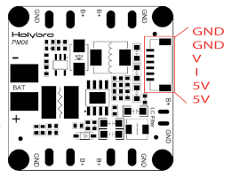
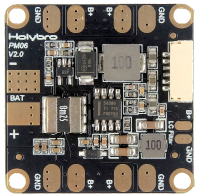

# Arduino's library for the use of the PM06 sensor

## The Holybro PM06

This module aims for power distribution of quadcopter UAV.
It has The battery input pads, the 4 full-power outputs (to ESC), one filtered output (GND, B+) 
and one connector originally designed for Pixhawk flight controller.

### Specifications

 *   PCB Current: 120A continued
 *   UBEC Current: 3A Max
 *   Power input: DC 7V~42V(2S~10S)
 *   Power output: DC 5.1V~5.3V
 *   Dimensions: 35x35x5mm
 *   Mounting holes: 30.5 mm x 30.5 mm
 *  Weight: 7g

### Voltage and current sensor

The module has a voltage and current sensor, providing the value by modulating the tension on the V pin & I pin.
These sensors look at the Voltage and current at the battery input. The output sensor pins have their maximum value
setup to 3.3V.
According to maximum possible voltage and current (42V & 120A) it gives an idea of the value of voltage dividers: 
12.727 and 36.36.

According to the manufacturer, these values are 18.1 and 36. Which mean that the board is able to measure tension up 
to 59.4V and current of 118.8A.

In real application, we will compute the true value for voltage divider by measuring the input voltage.
Measuring the input current gives some more difficulties as it needs a different mounting, then we will usually 
leave the divider value to 36.

## The driver

The driver for Arduino will only use this module as a sensor module. The module will then sense 
the voltage coming from the 5V output, V-sensor and I-sensor.

The driver will require 4 analog inputs of the Arduino:
 * Measure the Vcc (for precise measures)
 * Measure the 5V pm06 output
 * Measure the V-sense tension
 * Measure the I-sense tension
